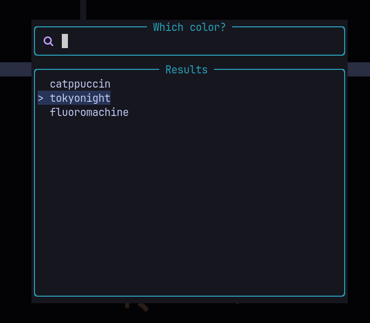

# theme-selector.nvim - Simple theme / colorscheme selector plugin

## What is this?
For now, just a snippet of Lua code that uses [telescope.nvim](https://github.com/nvim-telescope/telescope.nvim) to display a list of colorschemes to choose from.
It was initially part of my Telescope config, but now it is a mini-plugin, my first one at that.

It differs from the Telescope builtin `:Telescope colorscheme` in that you can choose the colorscheme list in this one.

Uses Telescope as a dependency, so be sure to put it as a dependency ;).

<br>

### Keybinds (will make them configurable in the future, for now hardcoded :/)
- <kbd>Ctrl + j / k</kbd> → Go down / up the list and put the color
- <kbd>Esc</kbd> or <kbd>Ctrl + c</kbd> → Exit the picker
- <kbd>Enter</kbd> → After filtering, choose the color and exit

<br>

### Configuration ↓

You first put in `require("theme-selector.colorschemes")` the ones you want to have in the picker.
Then the `require("theme-selector")` loads the plugin and the list :)

- Example → `lazy.nvim`
```lua
return {
  "mrs4ndman/theme-selector.nvim",
  cmd = { "Themer" },
  dependencies = {
    "nvim-telescope/telescope.nvim",
  },
  config = function()
    require("theme-selector.colorschemes").list = {
      "catppuccin",
      "tokyonight",
      "fluoromachine",
    }
    require("theme-selector")
  end,
}
```
<br>

### How it looks



### To-do / known issues
- [x] User-defined list
- [ ] User-configurable keybinds (it has defaults now, but no merging)
- [ ] Fix bug when filtering then moving
- [ ] Add `.setup()` to gather all options and loading.
